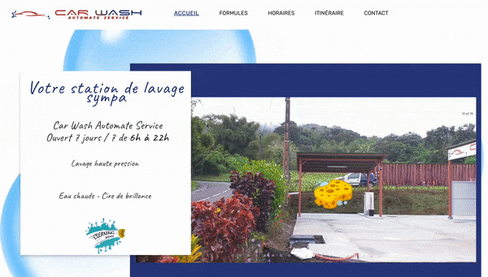
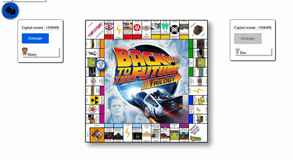

   <h1>👋🏽 Hi there, I'm Juliana here is my journey</h1>
   
    
   
 Frontend Enthusiast ❤️ | React.js, Redux, JS/TS | UI & Testing: Jest, Cypress, Sass, Styled Components

   

   I turn ideas into seamless, impactful user experiences with a focus on social and environmental value.
   By collaborating closely with product, UX/UI, and QA teams, I craft intuitive and engaging digital experiences. I thrive in both startups and large-scale organizations, delivering modular, maintainable, and well-tested applications that truly enhance users’ daily lives.
   

   
   

    Let's connect : 
    
<a href="https://www.linkedin.com/in/juliana-j-45500115b/">Linkedin </a>

    
<a href="https://www.malt.fr/profile/julianajeanmarie">Malt</a>

   

  

   <h1>Portfolio</h1>

   <h3><a href="https://trackdechets.beta.gouv.fr/">Front-end at Trackdéchets </a></h3>

   

      
      
   

    
    

   <h3><a href="https://prose.com/">Front-end at Prose </a></h3>

   

      
      
      
      
      
   

    
    

   <h3><a href="https://lacollection.airfrance.fr/fr-FR/listing">Front-end at PerfectStay</a></h3>

   

      
   

    
    

   <h3><a href="https://www.oui.sncf">Front-end at Oui.sncf </a></h3>
   

      
   

    

   <h1>Personal projects </h1>

   <h3><a href="https://essentialy.herokuapp.com/">Essential oils search engine (react + express + elasticsearch): </a></h3>

   

    
    
   

    
    

   <h3><a href="https://www.carwashautomateservice.fr/#accueil">Carwash static site (gatsby) </a></h3>
   

    
    
   

    
    

   <h3><a href="https://julianajm.github.io/back-to-the-future-monopoly/">Back to the future Monopoly (vanilla js)</a></h3>
   

    
    
   

